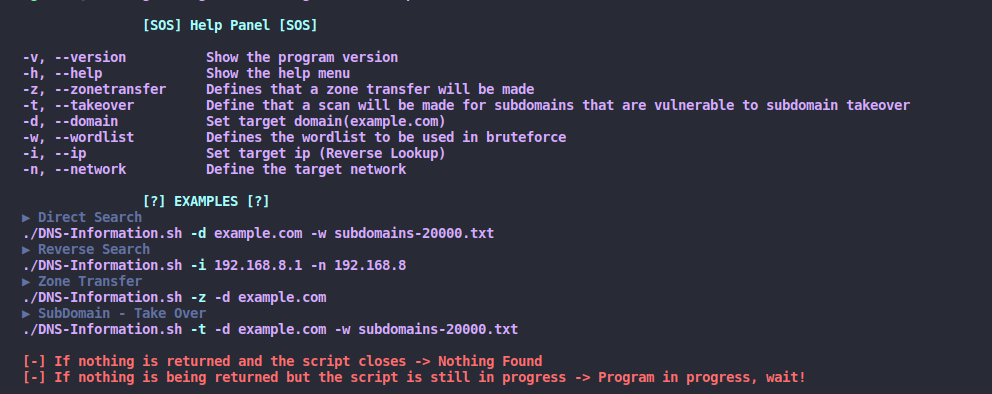
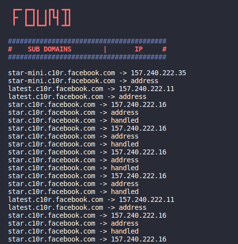

<h1 align="center">DNS-Information</h1>

* Tool for collecting information through DNS, in shell script

<h1 align="center">
    
</h1> 

* Help panel to run commands

<h1 align="center">
    
</h1>
 

* When running the script returns the sub domains related to the scanned DNS, as an example I used facebook.com

<h1 align="center">
    
</h1>

 ---
## 🦸 Author

<a href="#">
 
<a />

Made by Douglas Souza 👋🏽 Get in touch!

 

---
## README versions

[English 🇺🇸](./README.md)
